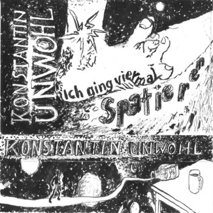

## 1. Ich wollte mal nach Trier
Ich war schon öfter in Berlin

doch ich hab dich da vermieden

ich war schon öfter in Berlin

bin nie lang genug geblieben

ich besuchte mal Stettin

und bin dir fern geblieben

ich besuchte mal Stettin

bin aber zu weit fortgetrieben

  

und wie jede Woche

suchst du mich heim

ich kann wohl nicht in Frieden sein

  

Ich war auch mal in Arizona

du nahmst dir eine Wohnung da

ich wusste, dass es dich gibt

und du wusstest, dass es mich in den Wahnsinn trieb

  

ich war dann ohne dich in Prag

doch auch da warst du am Start

warst sogar im selben Zug

und als sei das nicht schon längst genug

hast du Abends bei meinem Bett

gesessen und geraucht

ich wachte auf

doch du warst weg

  

ich wollte eigentlich mal nach Trier

doch auch da wärst du mit mir

deshalb glaube ich, ich bleibe hier.

## 2. (er)gehen
Saxofon Solo

## 3. Alles so wie sonst
wenn der Mond in mein Ghetto kracht

ich lieg wahrscheinlich wach in meinem Bett

und scher mich n Dreck

  

geh ruhig spazieren und schau dir die Gebäude an

vielleicht findest do sogar noch etwas Freude dran

Graffitis in schönem weißen Licht

mocht ich auch ganz gern

nur heute nicht

  

oder wie wärs mit nem guten Kaffee

in einem netten Café und ganz viel Klischee

ich kenn da eins ich war schon lange nicht mehr da

grüß die Kellnerin von mir

falls sie weiß, wer ich war

  

geh doch mal raus

heut ist ein schöner Tag

ich hatte heute leider

gar keinen guten Start

du findest da doch bestimmt noch einen Sinn

ich glaub an dich

das kriegst du hin

  

ich hoffe sehr deine Zeit hier hat dir trotzdem auch gefallen

mir persönlich ist leider nichts besondres aufgefallen

die S-Bahn, sie kommt

alles so wie sonst

bis zum nächsten Mal

## 4. Ich rannte einer Frau vors Auto
ich rannte einer Frau vors Auto

sie sah nicht, dass ich da war

dass ich da war

  

ich rannte einer Frau vors Auto

sie sah nicht, dass ich da war

ich rannte einer Frau vors Auto

obwohl es mir recht klar war

  

vielleicht tat Ichs

aus gewissem Verstand

und vielleicht ohne zu wissen

wo er sich befand

wo er sich befand

  

sie hielt kurz an

und versicherte sich dann

dass ich tot war

und der Regen tropfte fröhlich weiter

auf mein Gesicht

ja der Regen tropfte fröhlich weiter

auf mein Gesicht

## 5. Der Himmel hinter uns
Die Sonne scheint am Fernsehturm

es ist alles, wie es war

man erwartet keine Besserung

auch nicht dieses Jahr

ja die Zukunft ist recht blass geworden

man sieht ihr ihre Sorgen an

und ich frag sie, ob ich ihr helfen kann

sie sagt, ich könne ihre Sorgen haben

  

und der Himmel hinter uns

brennt immer noch im Spiegel

der Schnee fällt langsam auf die Kunst

heute bleib ich liegen

  

ich rauch noch eine Zigarette

schau schweigend Richtung weg

das war heut sicher nicht die letzte

alles bleibt an seinem Fleck

Hoffnung, wo ist die Wangenröte?

sie sagt, die sei schon längst verschwunden

ich würd ihr helfen, wenn ich könnte

doch meine Hände sind mir gebunden

  

und der Himmel hinter uns

brennt immer lichterloh

und mittlerweile weiß

ich auch ganz genau wieso

